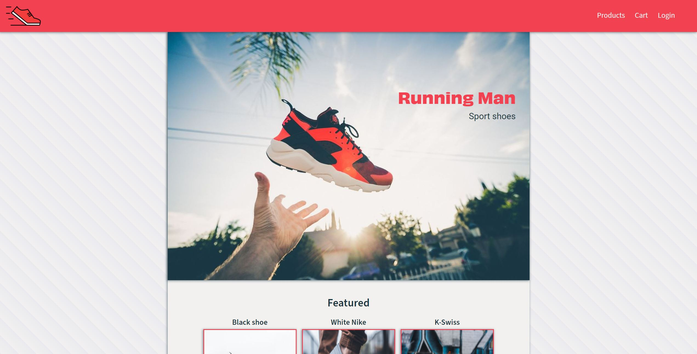
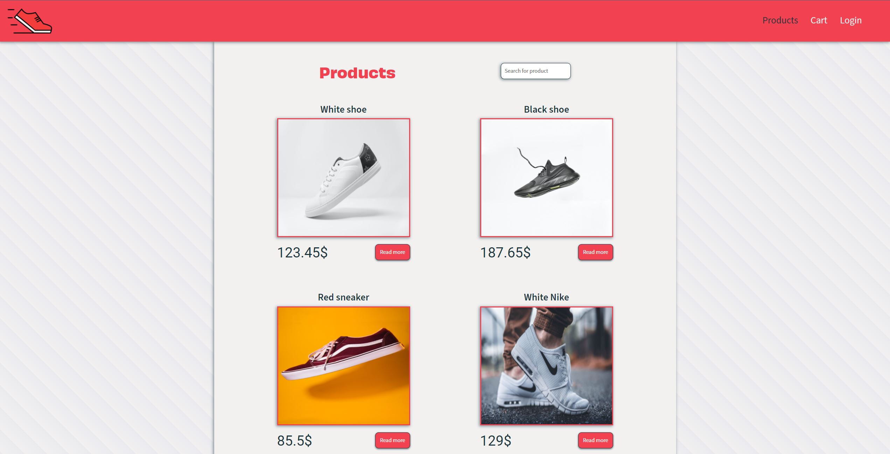
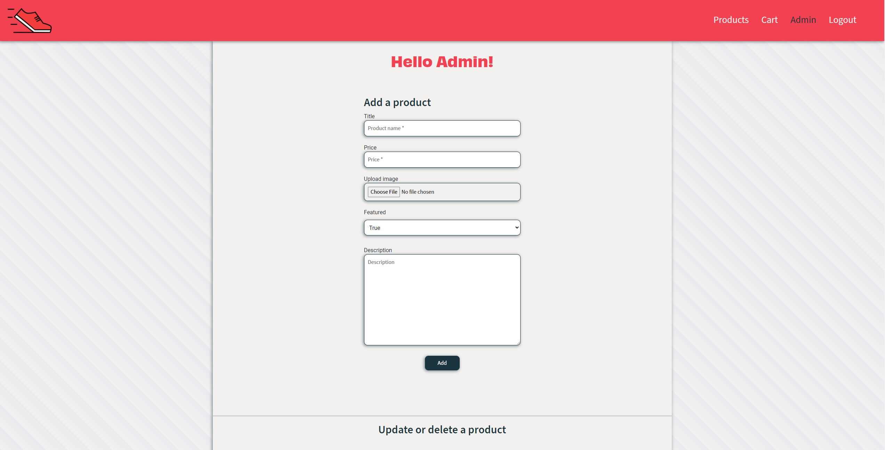

# Running Man - Sport shoes

> E-commerce site created as my semester-project
> Live demo [_here_](https://running-man.netlify.app/). <!-- If you have the project hosted somewhere, include the link here. -->

## Table of Contents

- [General Info](#general-information)
- [Technologies Used](#technologies-used)
- [Features](#features)
- [Screenshots](#screenshots)
- [Setup](#setup)
- [Usage](#usage)
- [Project Status](#project-status)
- [Room for Improvement](#room-for-improvement)
- [Contact](#contact)
<!-- * [License](#license) -->

## General Information

- The purpose of this project was to offer a website which sells sneakers. And has the possibility for users to log in and edit/add new products.
- This was my semester project assignment for front-end development year 2 at Noroff.

- This project only works on local server
<!-- You don't have to answer all the questions - just the ones relevant to your project. -->

## Technologies Used

- HTML
- SASS
- Javascript
- Bootstrap - version 5.1.3
- Strapi.io - version 4

## Features

List the ready features here:

- API call will display all products in array.
- Log in and out functional with Strapi user.
- Filter products at product page.
- Add products to cart, with sum adding up.

## Screenshots





<!-- If you have screenshots you'd like to share, include them here. -->

## Setup

Guide for installment can be found here [Strapi install](https://strapi.io/)

Step 1
-- Install strapi with: npx create-strapi-app@latest my-project

Step 2
-- Install the project in the VSC terminal with: npm install

Step 3
-- Type this into the terminal to run the project: npm run develop

Step 4
-- Create an account, start adding some products, and they will appear on the site when you call the API

## Usage

To run the project:

```
npm install
npm run develop
```

The admin panel will open at `http://localhost:1337/admin`.

If you get a warning about not being able to use port 1337, check that no other Strapi instances are running in another command line or terminal.

```
const baseUrl = "http://localhost:1337";
async function getFeatured() {

    const productsUrl = baseUrl + "/products";

    try {
        const response = await fetch(productsUrl);

        const json = await response.json();

        const product = json;

        renderFeatured(product);
        console.log(product);
    } catch (error) {
        displayMessage("alert-danger", "Products failed to load from server, come back later", ".featured");
    }

}

getFeatured();
```

## Project Status

Project is: / _complete_ /.

## Room for Improvement

Include areas you believe need improvement / could be improved. Also add TODOs for future development.

Room for improvement:

- Transfer it to live domain, so the products always displays.

To do:

- Transfor to live site

## Contact

Created by [@EivindSimonsen](https://www.linkedin.com/in/eivind-simonsen-9469121b9/) - feel free to contact me!
